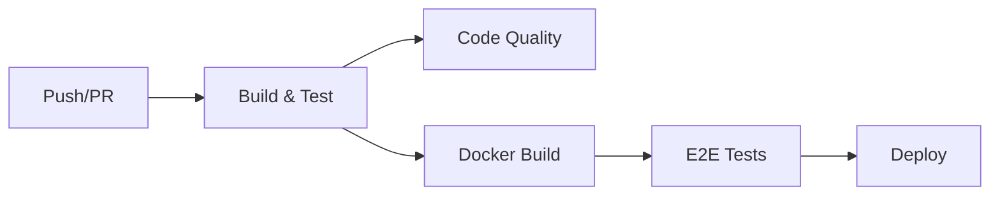

# 🏦 BankMore - Sistema Bancário Digital

[](https://dotnet.microsoft.com/)
[](https://blazor.net/)
[](https://kafka.apache.org/)
[](tests/)
[](https://www.docker.com/)

Sistema bancário digital moderno desenvolvido com .NET 9.0, demonstrando práticas avançadas de arquitetura de microsserviços, event-driven architecture, CQRS e observabilidade.

---

## 📑 Índice

- [🎯 Visão Geral](#-visão-geral)
- [🏗️ Arquitetura](#️-arquitetura)
- [🚀 Tecnologias](#-tecnologias)
- [✨ Funcionalidades](#-funcionalidades)
- [📋 Pré-requisitos](#-pré-requisitos)
- [🐋 Como Executar](#-como-executar-com-docker)
- [🧪 Testes](#-testes)
- [🌐 APIs Disponíveis](#-apis-disponíveis)
- [🗂️ Estrutura do Projeto](#️-estrutura-do-projeto)
- [🚀 CI/CD Pipeline](#-cicd-pipeline)

---

## 🎯 Visão Geral

O **BankMore** é um sistema bancário digital completo que implementa:

- ✅ **Arquitetura de Microsserviços** com 3 serviços independentes
- ✅ **Event-Driven Architecture** com Apache Kafka
- ✅ **CQRS Pattern** com MediatR
- ✅ **Clean Architecture** (Domain, Application, Infrastructure, API)
- ✅ **Autenticação JWT** com refresh tokens
- ✅ **Testes Automatizados** (41 unitários + 17 E2E)
- ✅ **Containerização** com Docker Compose
- ✅ **CI/CD Pipeline** com GitHub Actions
- ✅ **Observabilidade** (Logs, Métricas, Health Checks)

### 📊 Estatísticas

```
📦 4 Serviços (3 APIs + 1 Worker)     🧪 58 Testes (41 Unit + 12 Unit + 5 Unit)
🌐 1 Frontend Blazor WebAssembly      📄 ~10.000 linhas de código
🐋 8 Containers Docker                📚 SQLite como banco de dados
📨 Apache Kafka para mensageria       ⚡ Clean Architecture
🚀 CI/CD com GitHub Actions           ✅ Testes automatizados no pipeline
```

---

## 🏗️ Arquitetura

### Diagrama Simplificado

```
┌─────────────────────┐
│   Blazor Web        │
│   (Frontend SPA)    │
│   Port: 5000        │
└──────────┬──────────┘
           │ HTTP/JWT
           │
┌──────────┴────────────────────────┐
│                                   │
▼                                   ▼
┌─────────────────┐      ┌──────────────────────┐
│   API Conta     │◄────►│ API Transferência    │
│   Corrente      │ HTTP │                      │
│  (EF Core)      │      │     (Dapper)         │
│  Port: 5003     │      │    Port: 5004        │
└────────┬────────┘      └──────────┬───────────┘
         │                          │ publish
         │ HTTP (débito)            │
         │                          ▼
         │               ┌─────────────────────┐
         └──────────────►│   Kafka Topic:      │
                         │ transferencias-     │
                         │    realizadas       │
                         └──────────┬──────────┘
                                    │ consume
                                    ▼
                         ┌──────────────────┐
                         │  Worker Tarifas  │
                         │   (Background    │
                         │    Service)      │
                         └──────────────────┘
```

### Componentes

| Componente | Tecnologia | Porta | Descrição |
|------------|-----------|-------|-----------|
| **Blazor Web** | WebAssembly | 5000 | Interface de usuário moderna e responsiva |
| **API Conta Corrente** | ASP.NET Core + EF Core | 5003 | Gerencia contas, autenticação JWT, movimentações |
| **API Transferência** | ASP.NET Core + Dapper | 5004 | Processa transferências com rollback automático |
| **Worker Tarifas** | Background Service | - | Consome eventos Kafka e debita tarifas |
| **Kafka** | Apache Kafka | 9092 | Mensageria assíncrona |
| **Zookeeper** | Apache Zookeeper | 2181 | Coordenação do Kafka |
| **Redis** | Redis Cache | 6379 | Cache e idempotência |
| **Kafka UI** | Provectus Kafka UI | 8080 | Interface web para monitorar Kafka |

---

## 🚀 Tecnologias

### Backend

- **.NET 9.0** - Framework principal
- **ASP.NET Core 9.0** - APIs RESTful
- **Entity Framework Core 9.0.10** - ORM para API Conta
- **Dapper 2.1.66** - Micro-ORM para API Transferência
- **MediatR 13.1.0** - CQRS pattern
- **FluentValidation 12.1.0** - Validação de comandos
- **BCrypt.Net 4.0.3** - Hashing de senhas
- **SQLite** - Banco de dados

### Frontend

- **Blazor WebAssembly** - SPA client-side
- **Bootstrap 5** - Framework CSS
- **HttpClient** - Comunicação com APIs

### Mensageria

- **Apache Kafka 7.5.0** - Message broker
- **Confluent.Kafka 2.7.3** - Cliente .NET para Kafka

### Infraestrutura

- **Docker & Docker Compose** - Containerização
- **Redis 7-alpine** - Cache distribuído
- **Prometheus** - Métricas (via prometheus-net)
- **Serilog** - Logging estruturado

### Testes

- **xUnit 2.8.2 / 3.1.4** - Framework de testes
- **Moq 4.20.72** - Mocking
- **FluentAssertions 8.8.0** - Assertions
- **Selenium WebDriver 4.27.0** - Testes E2E
- **EF Core InMemory 9.0.10** - Testes com banco em memória

---

## ✨ Funcionalidades

### 🔐 Autenticação e Segurança

- ✅ Cadastro de usuários com validação de CPF
- ✅ Login com JWT (Access Token + Refresh Token)
- ✅ Senha criptografada com BCrypt
- ✅ Tokens com expiração configurável
- ✅ CORS configurado para frontend

### 💰 Gestão de Contas

- ✅ Criação de conta corrente
- ✅ Consulta de saldo
- ✅ Consulta de extrato (movimentações)
- ✅ Crédito e débito em conta
- ✅ Validação de CPF único

### 💸 Transferências

- ✅ Transferência entre contas
- ✅ Validação de saldo suficiente
- ✅ Rollback automático em caso de erro
- ✅ Idempotência garantida (Redis)
- ✅ Publicação de eventos no Kafka

### 📊 Tarifas

- ✅ Cobrança automática de tarifa por transferência (R$ 5,00)
- ✅ Processamento assíncrono via Kafka Consumer
- ✅ Persistência de tarifas no banco
- ✅ Débito automático na conta origem

### 🌐 Interface Web

- ✅ Página de Login
- ✅ Página de Cadastro
- ✅ Dashboard da Conta (saldo e dados)
- ✅ Página de Transferências
- ✅ Design responsivo

---

## 📋 Pré-requisitos

- **Docker Desktop** - [Download](https://www.docker.com/products/docker-desktop)
- **Git** - [Download](https://git-scm.com/)
- **.NET 9.0 SDK** (opcional, apenas para desenvolvimento local) - [Download](https://dotnet.microsoft.com/download/dotnet/9.0)

---

## 🐋 Como Executar com Docker

### 1. Clone o Repositório

```bash
git clone https://github.com/IgorAnjos/engineering-software-development-.git

cd BankMore
```

### 2. Inicie os Containers

```bash
docker-compose up -d
```

Isso irá iniciar:
- ✅ API Conta Corrente (http://localhost:5003)
- ✅ API Transferência (http://localhost:5004)
- ✅ Interface Web (http://localhost:5000)
- ✅ Worker Tarifas (background)
- ✅ Kafka + Zookeeper
- ✅ Redis
- ✅ Kafka UI (http://localhost:8080)

### 3. Acesse a Aplicação

- **Interface Web**: http://localhost:5000
- **API Conta Corrente (Swagger)**: http://localhost:5003/swagger
- **API Transferência (Swagger)**: http://localhost:5004/swagger
- **Kafka UI**: http://localhost:8080

### 4. Parar os Containers

```bash
docker-compose down
```

---

## 🧪 Testes

O projeto possui 58 testes automatizados:

### Testes Unitários (41 testes - BankMore.ContaCorrente.Tests)

```bash
dotnet test tests/BankMore.ContaCorrente.Tests/
```

Cobertura:
- ✅ Serviços (AuthService, ContaCorrenteService, CryptographyService)
- ✅ Validações (CPF, comandos)

### Testes Unitários (12 testes - BancoDigitalAna.ContaCorrente.Tests)

```bash
dotnet test tests/BancoDigitalAna.ContaCorrente.Tests/
```

Cobertura:
- ✅ Handlers (CadastrarContaHandler, MovimentacaoHandler)

### Testes Unitários (5 testes - BancoDigitalAna.Transferencia.Tests)

```bash
dotnet test tests/BancoDigitalAna.Transferencia.Tests/
```

Cobertura:
- ✅ Entidades (Transferencia)

### Testes E2E (19 testes - BankMore.Web.E2ETests)

⚠️ **Nota**: Alguns testes E2E podem falhar devido a timing issues. 12 testes estão passando consistentemente.

```bash
# Executar todos os testes E2E
dotnet test tests/BankMore.Web.E2ETests/

# Executar teste individual (exemplo)
dotnet test tests/BankMore.Web.E2ETests/ --filter "FullyQualifiedName~DeveCarregarPaginaLogin"
```

Cobertura:
- ✅ Fluxo de Login
- ✅ Fluxo de Cadastro
- ✅ Navegação entre páginas
- ✅ Validação de formulários

### Executar Todos os Testes

```bash
dotnet test
```

---

## 🌐 APIs Disponíveis

### API Conta Corrente (http://localhost:5003)

#### Autenticação

- `POST /api/v1/auth/cadastrar` - Cadastrar nova conta
- `POST /api/v1/auth/login` - Fazer login
- `POST /api/v1/auth/refresh` - Renovar access token

#### Contas

- `GET /api/v1/contas/{numeroContaOuCpf}` - Buscar conta por número ou CPF
- `GET /api/v1/contas/{numeroConta}/movimentacoes` - Consultar extrato

#### Info

- `GET /api/info` - Informações da API
- `GET /api/info/health` - Health check

### API Transferência (http://localhost:5004)

#### Transferências

- `POST /api/v1/transferencias` - Realizar transferência

#### Info

- `GET /api/info` - Informações da API
- `GET /api/info/health` - Health check

---

## 🗂️ Estrutura do Projeto

```
BankMore/
├── src/
│   ├── BankMore.ContaCorrente/
│   │   ├── Api/                           # Controllers, Program.cs
│   │   ├── Application/                   # Commands, Handlers, DTOs, Services
│   │   ├── Domain/                        # Entities, Interfaces, Events
│   │   └── Infrastructure/                # Data, Repositories, Migrations
│   ├── BankMore.Transferencia/
│   │   ├── Api/                           # Controllers, Program.cs
│   │   ├── Application/                   # Commands, Handlers, DTOs
│   │   ├── Domain/                        # Entities, Interfaces
│   │   └── Infrastructure/                # Data, Repositories
│   ├── BankMore.Tarifas/                  # Worker (Kafka Consumer)
│   └── BankMore.Web/                      # Blazor WebAssembly (Frontend)
├── tests/
│   ├── BankMore.ContaCorrente.Tests/      # 41 testes unitários
│   ├── BancoDigitalAna.ContaCorrente.Tests/ # 12 testes unitários
│   ├── BancoDigitalAna.Transferencia.Tests/ # 5 testes unitários
│   └── BankMore.Web.E2ETests/             # 19 testes E2E (12 passing)
├── sql/                                    # Scripts SQL
├── scripts/                                # Scripts PowerShell
├── docker-compose.yml                      # Orquestração de containers
└── BankMore.sln                           # Solution .NET
```

---

## 🔧 Configuração Local (Desenvolvimento)

### Variáveis de Ambiente

As principais configurações estão em `appsettings.json` e `appsettings.Development.json`:

**API Conta Corrente**:
```json
{
  "ConnectionStrings": {
    "DefaultConnection": "Data Source=contacorrente.db"
  },
  "JwtSettings": {
    "SecretKey": "sua-chave-super-secreta-com-no-minimo-32-caracteres",
    "ExpirationMinutes": 60,
    "RefreshTokenExpirationDays": 7
  },
  "Redis": {
    "ConnectionString": "localhost:6379"
  },
  "Kafka": {
    "BootstrapServers": "localhost:9092"
  }
}
```

**API Transferência**:
```json
{
  "ConnectionStrings": {
    "DefaultConnection": "Data Source=transferencia.db"
  },
  "ContaCorrenteApi": {
    "BaseUrl": "http://localhost:5003"
  },
  "Redis": {
    "ConnectionString": "localhost:6379"
  },
  "Kafka": {
    "BootstrapServers": "localhost:9092",
    "Topic": "transferencias-realizadas"
  }
}
```

### Executar Localmente (sem Docker)

1. **Iniciar infraestrutura** (Kafka, Redis, etc):
```bash
docker-compose up -d kafka redis zookeeper
```

2. **API Conta Corrente**:
```bash
cd src/BankMore.ContaCorrente/Api
dotnet run
```

3. **API Transferência**:
```bash
cd src/BankMore.Transferencia/Api
dotnet run
```

4. **Worker Tarifas**:
```bash
cd src/BankMore.Tarifas
dotnet run
```

5. **Interface Web**:
```bash
cd src/BankMore.Web
dotnet run
```

---

## 📖 Exemplos de Uso

### 1. Criar uma Conta

```bash
curl -X POST http://localhost:5003/api/v1/auth/cadastrar \
  -H "Content-Type: application/json" \
  -d '{
    "cpf": "12345678901",
    "nome": "João Silva",
    "senha": "senha123"
  }'
```

### 2. Fazer Login

```bash
curl -X POST http://localhost:5003/api/v1/auth/login \
  -H "Content-Type: application/json" \
  -d '{
    "numeroContaOuCpf": "12345678901",
    "senha": "senha123"
  }'
```

### 3. Consultar Conta

```bash
curl -X GET http://localhost:5003/api/v1/contas/00000001 \
  -H "Authorization: Bearer <seu-token>"
```

### 4. Realizar Transferência

```bash
curl -X POST http://localhost:5004/api/v1/transferencias \
  -H "Content-Type: application/json" \
  -H "Authorization: Bearer <seu-token>" \
  -d '{
    "idTransferencia": "550e8400-e29b-41d4-a716-446655440000",
    "numeroContaOrigem": "00000001",
    "numeroContaDestino": "00000002",
    "valor": 100.00
  }'
```

---

## 🐛 Troubleshooting

### Docker não inicia

```bash
# Verificar se o Docker está rodando
docker ps

# Limpar containers antigos
docker-compose down -v
docker system prune -a
```

### Portas em uso

Se alguma porta estiver em uso, edite o `docker-compose.yml`:
```yaml
services:
  web:
    ports:
      - "5001:80"  # Altere 5000 para 5001
```

### Banco de dados corrompido

```bash
# Remover volumes do Docker
docker-compose down -v

# Recriar containers
docker-compose up -d
```

### Testes E2E falhando

Os testes E2E podem falhar por:
- Aplicação não estar rodando (execute `docker-compose up -d` primeiro)
- Timing issues (aumentar timeouts em `SeleniumTestBase.cs`)
- Porta incorreta (verificar `BaseUrl` em `SeleniumTestBase.cs` - deve ser `http://localhost:5000`)

---

## 🚀 CI/CD Pipeline

O projeto possui um pipeline completo de CI/CD configurado com GitHub Actions (`.github/workflows/ci-cd.yml`).

### Fluxo do Pipeline



### Jobs Configurados

#### 1️⃣ **Build & Test**
- ✅ Checkout do código
- ✅ Setup .NET 9.0
- ✅ Restauração de dependências
- ✅ Build da solution
- ✅ Execução de testes unitários (41 testes)
- ✅ Geração de relatório de cobertura
- ✅ Upload para Codecov

#### 2️⃣ **Code Quality Analysis**
- ✅ Análise estática de código
- ✅ Verificação de boas práticas
- ✅ Detecção de code smells

#### 3️⃣ **Docker Build**
- ✅ Build de 4 imagens Docker:
  - `api-conta`
  - `api-transferencia`
  - `worker-tarifas`
  - `web`
- ✅ Push para GitHub Container Registry (ghcr.io)
- ✅ Versionamento automático com tags
- ✅ Cache de layers para builds rápidos

#### 4️⃣ **E2E Tests** (apenas na branch `main`)
- ✅ Inicialização do ambiente com Docker Compose
- ✅ Health checks dos serviços
- ✅ Execução de testes E2E com Selenium
- ✅ Cleanup automático

#### 5️⃣ **Deploy** (apenas na branch `main`)
- ✅ Deploy condicional para produção
- ✅ Notificações de sucesso/falha
- ✅ Environment protection rules

### Triggers

O pipeline é executado em:
- ✅ Push para branches `main` e `develop`
- ✅ Pull Requests para `main` e `develop`
- ✅ Execução manual (`workflow_dispatch`)

### Variáveis de Ambiente

```yaml
DOTNET_VERSION: '9.0.x'
DOCKER_REGISTRY: ghcr.io
IMAGE_PREFIX: bankmore
```

### Como Visualizar

1. Acesse a aba **Actions** no GitHub
2. Veja o histórico de execuções
3. Clique em um workflow para ver detalhes

---

## 🤝 Contribuindo

Contribuições são bem-vindas! Para contribuir:

1. Fork o projeto
2. Crie uma branch para sua feature (`git checkout -b feature/NovaFuncionalidade`)
3. Commit suas mudanças (`git commit -m 'Adiciona nova funcionalidade'`)
4. Push para a branch (`git push origin feature/NovaFuncionalidade`)
5. Abra um Pull Request

---

## 📝 Licença

Este projeto é educacional e não possui licença comercial.

---

## 📚 Recursos Adicionais

- [Documentação .NET](https://docs.microsoft.com/dotnet/)
- [Blazor WebAssembly](https://docs.microsoft.com/aspnet/core/blazor/)
- [Apache Kafka](https://kafka.apache.org/documentation/)
- [Docker](https://docs.docker.com/)
- [Clean Architecture](https://blog.cleancoder.com/uncle-bob/2012/08/13/the-clean-architecture.html)
- [CQRS Pattern](https://martinfowler.com/bliki/CQRS.html)

---

<div align="center">

### 🏦 BankMore - Sistema Bancário Moderno 🚀

**Desenvolvido com .NET 9.0, Blazor WebAssembly, Apache Kafka e Clean Architecture**

[](https://www.docker.com/)
[](https://dotnet.microsoft.com/)
[](https://blazor.net/)

</div>
